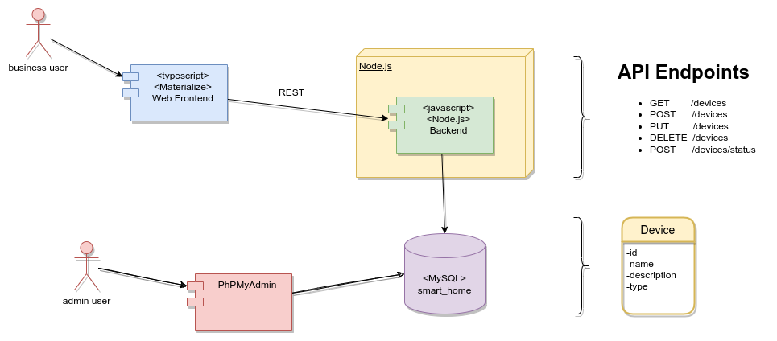

UBA - Especialización en Internet de las Cosas - Trabajo práctico integrador
============================================================================================

El presente trabajo practico es un fork del [repositorio](https://github.com/mramos88/app-fullstack-base-2023-i08) y se basa en el proyecto[Goto IoT](https://www.gotoiot.com/)(repo [Github de Goto IoT:](https://github.com/gotoiot)).

### Arquitectura de la aplicación

A continuación se puede apreciar una imagen de la arquitectura de la aplicación.

* El Frontend web: El cliente web es una Single Page Application que se comunica con el servicio en NodeJS mediante JSON a través de requests HTTP. Puede consultar el estado de los dispositivos en la base de datos (por medio del servicio en NodeJS) y también cambiar el estado de los mismos. Los estilos del código están basados en **Material Design**.

* El Backend: El servicio en **NodeJS** posee distintos endpoints para comunicarse con el cliente web mediante requests HTTP enviando **JSON** en cada transacción. Procesando estos requests es capaz de comunicarse con la base de datos para consultar y controlar el estado de los dispositivos, y devolverle una respuesta al cliente web también en formato JSON. Así mismo el servicio es capaz de servir el código del cliente web.

* La base de datos: La base de datos se comunica con el servicio de NodeJS y permite almacenar el estado de los dispositivos en la tabla **Devices**. Ejecuta un motor **MySQL versión 5.7** y permite que la comunicación con sus clientes pueda realizarse usando usuario y contraseña en texto plano. En versiones posteriores es necesario brindar claves de acceso, por este motivo la versión 5.7 es bastante utilizada para fases de desarrollo.

* El administrador de la DB:Para esta aplicación se usa **PHPMyAdmin**, que es un administrador de base de datos web muy utilizado y que podés utilizar en caso que quieras realizar operaciones con la base, como crear tablas, modificar columnas, hacer consultas y otras cosas más.

### Funcionalidades provistas
* Listado de dispositivos
* Eliminación de dispositivos
* Agregado de nuevos dispositivos
* Edición de dispositivos existentes
* Actualización del status del dispositivo

### API Endpoints
* Listar dispositivos (GET /devices): No toma parámetros y devuelve una lista de los dispositivos
* Crear dispositivo (POST /devices): Toma como parámetro un objeto
* Actualizar dispositivo (PUT /devices): Toma como parámetro un objeto con los atributos del dispositivo y los actualiza en la base de datos
* Eliminar dispositivo (DELETE /devices): Toma como parámetro el id de un dispositivo y lo elimina de la base de datos
* Actualizar status del dispositivo (PUT /devices/status): Toma como parámetro el status y el Id del dispositivo para actualizarlo en la base de datos.

### Setup y ejecución del proyecto

Para correr este proyecto es necesario que instales `Docker` y `Docker Compose`. En [este artículo](https://www.gotoiot.com/pages/articles/docker_installation_linux/) están los detalles para instalar Docker y Docker Compose en una máquina Linux.

Una vez instalado Docker y Docker Compose, se clona el proyecto. Para ejecutar la aplicación tenes que correr el comando `docker-compose up` desde la raíz del proyecto. Este comando va a descargar las imágenes de Docker de node, de typescript, de la base datos y del admin de la DB, y luego ponerlas en funcionamiento. Para acceder al cliente web ingresa a a la URL [http://localhost:8000/](http://localhost:8000/) y para acceder al admin de la DB accedé a [localhost:8001/](http://localhost:8001/). En el login del administrador, el usuario para acceder a la db es `root` y la contraseña es la variable `MYSQL_ROOT_PASSWORD` del archivo `docker-compose.yml`.

Al iniciar el servicio de la base de datos, si esta no está creada toma el archivo que se encuentra en `db/dumps/smart_home.sql` para crear la base de datos automáticamente. En ese archivo está la configuración de la tabla `Devices` y otras configuraciones más.

## Tecnologías utilizadas 🛠️

Las tecnologías utilizadas son las siguientes:
* [Docker](https://www.docker.com/) - Ecosistema que permite la ejecución de contenedores de software.
* [Docker Compose](https://docs.docker.com/compose/) - Herramienta que permite administrar múltiples contenedores de Docker.
* [Node JS](https://nodejs.org/es/) - Motor de ejecución de código JavaScript en backend.
* [MySQL](https://www.mysql.com/) - Base de datos para consultar y almacenar datos.
* [PHPMyAdmin](https://www.phpmyadmin.net/) - Administrador web de base de datos.
* [Material Design](https://material.io/design) - Bibliotecas de estilo responsive para aplicaciones web.
* [TypeScript](https://www.typescriptlang.org/) - Superset de JavaScript tipado y con clases.

