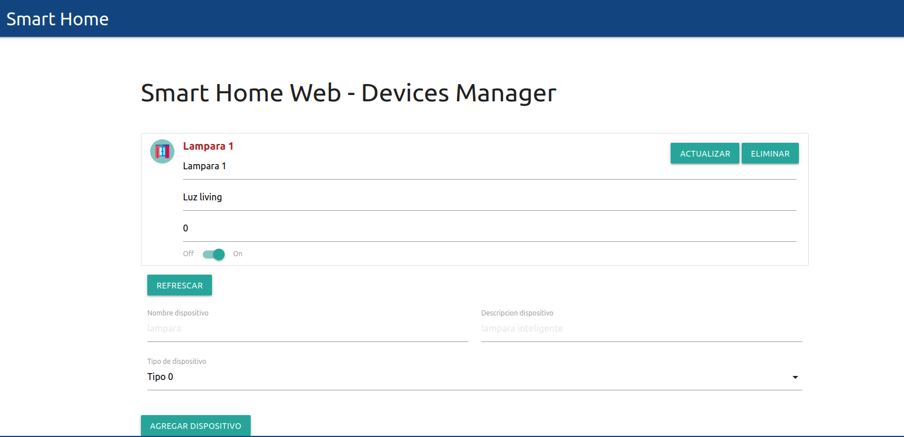

UBA - Especialización en Internet de las Cosas 
Desarrollo de Aplicaciones Web - 
Trabajo práctico integrador
============================================================================================

El presente trabajo practico es un fork del [repositorio](https://github.com/mramos88/app-fullstack-base-2023-i08) y se basa en el proyecto[Goto IoT](https://www.gotoiot.com/)(repo [Github de Goto IoT:](https://github.com/gotoiot)).

### Perspectiva del usuario de negocio - Instrucciones de uso

Una vez completados los pasos para el [setup del proyecto](https://github.com/kronleuchter85/ceiot_desarrollo_de_applicaciones_web#setup-y-ejecuci%C3%B3n-del-proyecto) e ingresado al home de la [WebApp](http://localhost:8000/) se puede visualizar lo siguiente:

En el centro se puede visualizar la lista de dispositivos disponibles. En el caso de la captura arriba, sólo podemos encontrar Lampara 1. Podemos apreciar que los campos para poder visualizar sus atributos son en realidad del tipo textfield, por lo cual además vamos a poder cambiar sus valores desde ahí mismo. Para ello, una vez modificado cualquiera de sus valores, presionamos el botón 'Actualizar' y esto guardará los cambios.
Mediante el botón 'Eliminar' vamos a poder eliminar el dispositivo de la base de datos, y mediante el componente checkbutton On/Off vamos a poder cambiar su estado de habilitación.

Mediante el botón 'Agregar dispositivo' vamos a poder guardar un nuevo dispositivo con los valores ingresados en los campos indicados.

Finalmente, mediante el botón 'Refrescar' podemos volver a traer todos los dispositivos disponibles, aunque esto no debería ser necesario ya que por cada creación, modificación, eliminación la lista se refresca automáticamente.

### Arquitectura de la aplicación

A continuación se puede apreciar una imagen de la arquitectura de la aplicación.

* El Frontend web: El cliente web es una Single Page Application que se comunica con el servicio en NodeJS mediante JSON a través de requests HTTP. Puede consultar el estado de los dispositivos en la base de datos (por medio del servicio en NodeJS) y también cambiar el estado de los mismos. Los estilos del código están basados en **Material Design**.

* El Backend: El servicio en **NodeJS** posee distintos endpoints para comunicarse con el cliente web mediante requests HTTP enviando **JSON** en cada transacción. Procesando estos requests es capaz de comunicarse con la base de datos para consultar y controlar el estado de los dispositivos, y devolverle una respuesta al cliente web también en formato JSON. Así mismo el servicio es capaz de servir el código del cliente web.

* La base de datos: La base de datos se comunica con el servicio de NodeJS y permite almacenar el estado de los dispositivos en la tabla **Devices**. Ejecuta un motor **MySQL versión 5.7** y permite que la comunicación con sus clientes pueda realizarse usando usuario y contraseña en texto plano. En versiones posteriores es necesario brindar claves de acceso, por este motivo la versión 5.7 es bastante utilizada para fases de desarrollo.

* El administrador de la DB:Para esta aplicación se usa **PHPMyAdmin**, que es un administrador de base de datos web muy utilizado y que podés utilizar en caso que quieras realizar operaciones con la base, como crear tablas, modificar columnas, hacer consultas y otras cosas más.

### Funcionalidades provistas
* Listado de dispositivos
* Eliminación de dispositivos
* Agregado de nuevos dispositivos
* Edición de dispositivos existentes
* Actualización del status del dispositivo

### API Endpoints
* Listar dispositivos (GET /devices): No toma parámetros y devuelve una lista de los dispositivos
* Crear dispositivo (POST /devices): Toma como parámetro un objeto
* Actualizar dispositivo (PUT /devices): Toma como parámetro un objeto con los atributos del dispositivo y los actualiza en la base de datos
* Eliminar dispositivo (DELETE /devices): Toma como parámetro el id de un dispositivo y lo elimina de la base de datos
* Actualizar status del dispositivo (PUT /devices/status): Toma como parámetro el status y el Id del dispositivo para actualizarlo en la base de datos.

### Setup y ejecución del proyecto

Para correr este proyecto es necesario que instales `Docker` y `Docker Compose`. En [este artículo](https://www.gotoiot.com/pages/articles/docker_installation_linux/) están los detalles para instalar Docker y Docker Compose en una máquina Linux.

Una vez instalado Docker y Docker Compose, se clona el proyecto. Para ejecutar la aplicación tenes que correr el comando `docker-compose up` desde la raíz del proyecto. Este comando va a descargar las imágenes de Docker de node, de typescript, de la base datos y del admin de la DB, y luego ponerlas en funcionamiento. Para acceder al cliente web ingresa a a la URL [http://localhost:8000/](http://localhost:8000/) y para acceder al admin de la DB accedé a [localhost:8001/](http://localhost:8001/). En el login del administrador, el usuario para acceder a la db es `root` y la contraseña es la variable `MYSQL_ROOT_PASSWORD` del archivo `docker-compose.yml`.

Al iniciar el servicio de la base de datos, si esta no está creada toma el archivo que se encuentra en `db/dumps/smart_home.sql` para crear la base de datos automáticamente. En ese archivo está la configuración de la tabla `Devices` y otras configuraciones más.

## Tecnologías utilizadas 🛠️

Las tecnologías utilizadas son las siguientes:
* [Docker](https://www.docker.com/) - Ecosistema que permite la ejecución de contenedores de software.
* [Docker Compose](https://docs.docker.com/compose/) - Herramienta que permite administrar múltiples contenedores de Docker.
* [Node JS](https://nodejs.org/es/) - Motor de ejecución de código JavaScript en backend.
* [MySQL](https://www.mysql.com/) - Base de datos para consultar y almacenar datos.
* [PHPMyAdmin](https://www.phpmyadmin.net/) - Administrador web de base de datos.
* [Material Design](https://material.io/design) - Bibliotecas de estilo responsive para aplicaciones web.
* [TypeScript](https://www.typescriptlang.org/) - Superset de JavaScript tipado y con clases.
